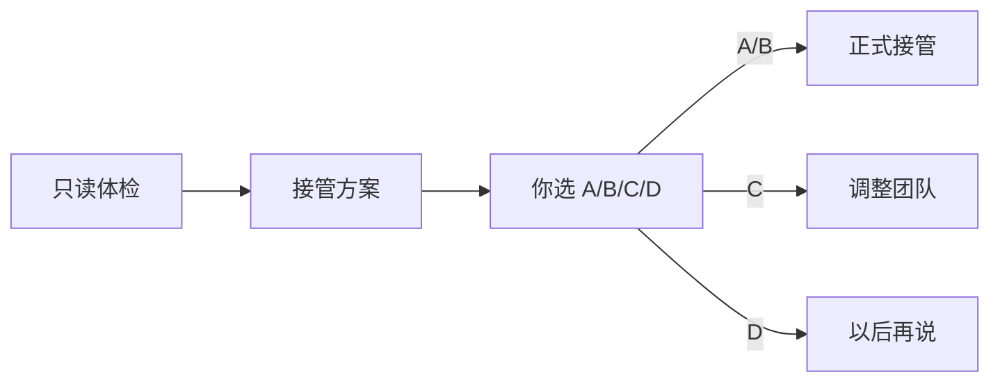
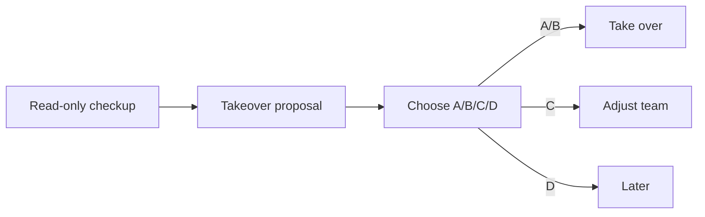

# Markdown Output Guide

Use this when GaoGao Office writes user-visible chat output for onboarding, proposals, migration reports, maintenance reports, retirement summaries, or employee launch prompts.

The goal is readability, not decoration. Use the smallest Markdown structure that helps the user scan, decide, copy, or verify. Respect the user's preferred form of address. In Chinese, default to natural `你` wording when no preference is visible; use `BOSS` only if the user already chose it. In English chat, use natural `you` wording.

## Default Rules

- Write normal prose first. Add boxes only when they improve readability, emphasis, copying, comparison, or status tracking.
- Use at most 2-4 formatting types in one ordinary reply. Avoid turning every paragraph into a callout.
- Keep headings short and practical: `项目体检`, `我的判断`, `接管方案`, `下一步`.
- Keep takeover choice options as plain A/B/C/D text lists, not tables or card-like layouts.
- Put exact user replies, employee prompts, commands, and reusable messages in fenced `text` blocks.

## Format Selection

| Format | Use For | Avoid For |
|---|---|---|
| Normal prose | Brief context and transitions | Long dense status dumps |
| `inline code` | Paths, files, commands, task IDs, status values | Ordinary emphasis |
| Blockquote `>` | Safety promises, key reminders, current state | Multi-section reports |
| Alert quote | Risks, destructive actions, must-not-miss notes | Routine information |
| Fenced `text` | Copyable replies, prompts, plain instructions | Explanatory paragraphs |
| Language code block | JSON, config, commands, code | Non-code narrative |
| Table | Role plans, task status, migration maps | Long prose or choice options |
| Task list | Checkups, takeover completion, cleanup status | Role descriptions |
| `<details>` | Optional long logs or extra evidence | Required decisions |
| Mermaid | First-use roadmap or complex workflows | Ordinary status updates |

## Standard Blocks

Use plain blockquotes for stable rendering:

```md
> 现在只读，不写文件。等你回复选项后，我再执行对应动作。
```

Use alert-style quotes only when the message is important even if the client renders it as a normal quote:

```md
> [!WARNING]
> 这个选项会移动旧资料。执行前我会列出清单，不会静默删除。
```

Use `text` blocks for copyable replies. When an example contains a fenced code block, wrap the outer example in four backticks so nested fences do not break:

````md
```text
进入方向顾问模式
```
````

## First-Use Reply Shape

Use this structure for a Chinese first invocation:

````md
我先给这个项目做一次只读体检：看目录、README、旧规则和项目线索，先不写文件。
体检后我会给你一份接管方案；你确认前，我不会创建 `Agent Office/`、改 `AGENTS.md` 或邀请员工。

> 现在只读，不写文件。等你看到方案并回复 A/B/C/D 后，我再执行对应动作。



**项目体检**
- 路径：`...`
- 线索：...

**我的判断**
我判断这是 ...

**下一步**
如果这个判断不对，直接纠正我；如果判断对，我会给你接管方案。
````

Use this structure for an English first invocation:

````md
I’ll give this project a read-only office checkup first: directory clues, README, existing rules, and old project memory. I will not write files yet.
After the checkup, I’ll bring you a takeover proposal; before you confirm, I will not create `Agent Office/`, change `AGENTS.md`, or onboard employees.

> Read-only for now. After you review the proposal and reply A/B/C/D, I’ll take only the action you chose.



**Project Checkup**
- Path: `...`
- Clues: ...

**My Read**
I think this is ...

**Next**
If this is wrong, correct me; if it is right, I’ll bring you the takeover proposal.
````

Use this first-use roadmap only during onboarding, migration takeover, or upgrade takeover. Do not add Mermaid to ordinary progress updates.

If the project purpose is unknown, ask one light question in a `text` block:

````md
```text
这个项目主要想做什么？随便说一句就行，我先按你的描述判断该怎么组团队。
```
````

English:

````md
```text
What is this project mainly trying to do? One casual sentence is enough; I’ll use it to decide how to shape the team.
```
````

## Organization Proposal Shape

Use a short explanation plus a table. Keep the first proposal to four blocks at most: project judgment, recommended mode, team/boundaries, and A/B/C/D.

````md
**接管方案**

| 员工 | 为什么需要 | 职责边界 | 是否入职 |
|---|---|---|---|
| 项目总管 | 统一接收你的需求 | 公共区、任务路由、验收 | 当前窗口 |
| 设计师 | 稳定视觉判断 | 设计相关文件和自己的员工区 | 建议 |

```text
回一个字母即可：A / B / C / D
```

A. 单员工（推荐）
创建 `Agent Office/`，应用 `AGENTS.md`；当前项目总管窗口正式接管，不邀请额外员工。

B. 多员工
创建 `Agent Office/`，应用 `AGENTS.md`；邀请合适员工入职，由项目总管统一调度。

C. 调整团队
你指定员工数量或岗位，我来分配职责、边界和入职提示。

D. 以后再说
不创建文件，不修改项目。
````

If multi-employee is recommended, swap A and B:

```md
A. 多员工（推荐）
创建 `Agent Office/`，应用 `AGENTS.md`；按推荐团队邀请员工入职，由项目总管统一调度。

B. 单员工
创建 `Agent Office/`，应用 `AGENTS.md`；只让当前项目总管窗口正式接管，不邀请额外员工。
```

English:

````md
**Takeover Proposal**

| Employee | Why Needed | Boundary | Onboard? |
|---|---|---|---|
| Project Manager | Receive requests and keep the office coherent | Public office files, task routing, final reports | Current chat |
| Designer | Keep visual judgment stable | Design-related files and this employee folder | Recommended |

```text
Reply with one letter: A / B / C / D
```

A. One-person office (recommended)
Create `Agent Office/`, apply `AGENTS.md`, and let the current project-manager chat take over without employee chats.

B. Multi-employee office
Create `Agent Office/`, apply `AGENTS.md`, and onboard suitable employees under the project manager.

C. Adjust the team
You specify employee count or job titles; I will assign responsibilities, boundaries, and onboarding prompts.

D. Later
Do not create files or modify the project.
````

If multi-employee is recommended, swap A and B:

```md
A. Multi-employee office (recommended)
Create `Agent Office/`, apply `AGENTS.md`, and onboard the recommended employees under the project manager.

B. One-person office
Create `Agent Office/`, apply `AGENTS.md`, and let the current project-manager chat take over without employee chats.
```

## Completion Shapes

For A-style formal takeover, use a task list:

```md
**接管完成**

- [x] 创建 `Agent Office/`
- [x] 应用 `AGENTS.md`
- [x] 邀请员工入职
- [x] 派工策略已记录
- [ ] 安排项目任务

> 当前还没有安排任务。你可以继续只和项目总管窗口说话。
```

English:

```md
**Takeover Complete**

- [x] Created `Agent Office/`
- [x] Applied `AGENTS.md`
- [x] Employees onboarded
- [x] Dispatch policy recorded
- [ ] Assigned project work

> No project task is assigned yet. You can keep talking to this project-manager chat.
```

After takeover, ask whether the user wants direction-advisor mode:

````md
> 办公室已经就位，但我还没有安排项目任务。

```text
你现在对这个项目有没有明确方向？有的话直接说你的想法；没有的话我来帮你判断 2-3 个方向。
```
````

English:

````md
> The office is ready, but no project task has been assigned yet.

```text
Do you already have a clear direction for this project? If yes, tell me your idea; if not, I’ll help judge 2-3 possible directions.
```
````

## Final Answer Preflight

Before replying to the user, remove private drafting traces. The final answer must not contain:

- internal thinking such as `Wait`, `Need final`, `analysis`, `draft`, `TODO`, `abs?`, or `no need?`
- implementation chatter such as temporary config names, internal IDs, or "I need to figure out the link syntax"
- raw multi-thread logs unless the user asks for them
- uncertain Markdown link experiments

If a local link format is uncertain, write the plain absolute path. Keep the final answer to user outcomes: what changed, where it is, what is waiting, and what the user can do next.

## Migration And Maintenance Shapes

Use tables for migration maps:

```md
| 旧资料 | 吸收位置 | 处理方式 |
|---|---|---|
| `vibe/notes.md` | `project-brief.md` | 入库后归档 |
```

Use task lists for cleanup or retirement:

```md
**撤岗完成**

- [x] 员工线程已归档
- [x] 未来任务已取消
- [x] 已完成任务保持 `done`
- [x] 资料未删除
```
